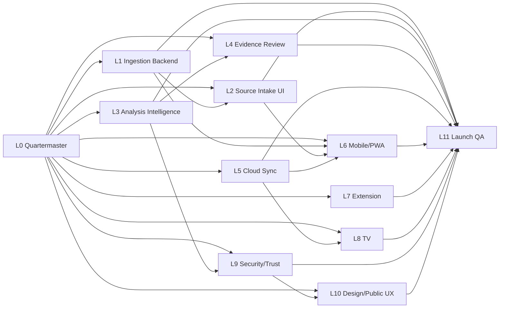

# Yentl Reset-To-Finish Agent Orchestration

Date: 2026-06-14
Workspace: `/Users/israelbitton/Live FactCheck`
Lead orchestrator: Codex in the main Yentl thread

## Current State

Yentl is no longer a blank build. The current tree contains a broad Next app with session workspace, ingestion APIs, source review, saved sessions, PWA/mobile surfaces, TV room mode, Chrome extension, validation fixtures, proof scripts, and launch gates.

Authoritative current proof:

- `docs/superpowers/validation/release-readiness-proof.json`
- `docs/superpowers/validation/ingestion-ui-local-proof.json`
- `docs/superpowers/validation/speaker-attribution-proof.json`
- `docs/superpowers/validation/cloud-sync-local-proof.json`
- `agent-work/product-build-evidence/`

Current readiness snapshot:

- Local proof battery: 13/13 passing.
- Deploy proof artifacts: 5/5 passing, but several are older than local proof.
- External proof: 0/3 passing.
- `launch_ready`: false.

Current launch blockers:

1. Sensitive speaker-attribution rows need human/editorial approval.
2. Authenticated cloud sync needs Clerk, database, and a real auth header.
3. Production authenticated cloud sync needs the same proof after deploy.
4. Physical iOS/Android device canaries are missing.
5. Large real media production canaries are missing.
6. Current dirty tree has not been committed, pushed, CI-proven, deployed, and production-smoked.

## Dashboard

Shared HTML dashboard:

- `docs/orchestration/yentl-reset-to-finish-dashboard.html`

Each agent owns exactly one lane block in the dashboard. The orchestrator owns the page shell, cross-lane dependencies, and final integration status.

Dashboard edit rule:

- Agents may edit only the lane section marked with their lane id.
- If an agent cannot safely edit the dashboard, it writes a status report to `agent-work/reporting-inbox/` and the orchestrator updates the dashboard.
- Do not edit another lane's status, evidence links, checkboxes, or blockers.

## Worktree And Branch Rules

The shared checkout is dirty and should not be used by multiple editors at once.

Default setup for code-editing agents:

```bash
cd /Users/israelbitton/Live\ FactCheck
git status --porcelain=v1 -b
git worktree add ../Live-FactCheck-worktrees/<lane-slug> -b codex/yentl-<lane-slug>-2026-06-14
cd ../Live-FactCheck-worktrees/<lane-slug>
```

Rules:

- Every editing agent uses a unique branch prefixed with `codex/`.
- Every editing agent uses a unique worktree path under `/Users/israelbitton/Live-FactCheck-worktrees/`.
- Read-only agents may inspect the shared checkout but must not write there.
- No agent stages, commits, pushes, deploys, resets, rebases, checks out over files, or cleans unless the user explicitly approves.
- If a file is dirty in the shared checkout and also needed by an agent, the agent stops and writes a blocker unless the orchestrator assigns ownership.
- Agents write progress to their own folder under `agent-work/<lane-slug>/`.
- Agents write a concise report to `agent-work/reporting-inbox/<lane-slug>-<timestamp>-report.md`.

## Lane Map

| Lane | Agent | Goal | Can Start | Depends On | Primary Evidence |
|---|---|---|---|---|---|
| L0 | Quartermaster | Protect worktrees, assign file ownership, maintain dashboard integrity. | Now | None | `git status`, conflict map, dashboard update |
| L1 | Ingestion Backend | Make every media/text/source ingestion path production-hard. | Now | L0 for ownership | `ingestion:proof:local`, `ingestion:proof:large-real-media` |
| L2 | Source Intake UI | Make all source entry/recovery screens polished across desktop/mobile. | Now | L0, partial L1 | `ingestion:proof:ui`, browser proof |
| L3 | Analysis Intelligence | Perfect multi-speaker attribution, ownership, meta-read, and cautious output. | Now | L0 | `analysis:proof:speaker-attribution`, `analysis:proof:metaread` |
| L4 | Evidence And Source Review | Make citations, source cards, quote anchors, exports, and evidence ranking trustworthy. | Now | L3 for claim semantics | source review tests, export tests |
| L5 | Cloud Sync | Prove account-backed saved sessions across devices. | Conditional | Clerk, DB, auth header | `cloud-sync:proof:local`, `cloud-sync:proof:deploy` |
| L6 | Mobile/PWA/Devices | Prove iOS/Android share, file, mic, install, restore flows. | Now for prep; physical proof after deploy | L1, L2, L5 for restore | `mobile:proof:local`, `mobile:proof:devices` |
| L7 | Chrome Extension | Finish current-tab capture, panel, packaging, real-page proof. | Now | L1/L3 as needed | extension proof scripts, real page screenshots |
| L8 | TV Room Mode | Make room display reliable for live and restored sessions. | Now | L5 for cloud restore | TV tests, browser proof |
| L9 | Security/Privacy/Trust | Close SSRF, upload, auth, legal-copy, privacy, trust gates. | Now | L1, L5 | security tests, trust copy proof |
| L10 | Design System/Public UX | Polish landing, trust pages, app shell, visual consistency. | Now | L9 for copy constraints | visual/browser proof, a11y proof |
| L11 | Launch QA/Release | Integrate branches, run full regression, CI, deploy, smoke. | Last | All editing lanes | `release:readiness`, CI, production smoke |

## Dependency Shape



## Orchestrator Duties

The orchestrator owns:

- Dashboard shell and cross-lane status.
- Worktree/branch assignment.
- File ownership and conflict decisions.
- Integration order.
- Proof gate interpretation.
- Final launch-readiness decision.

The orchestrator does not mark the project complete until current evidence proves every objective requirement: ingestion, analysis quality, UI/UX, mobile/PWA, extension, TV, cloud sync, security/trust, CI/deploy, and production smoke.

## Reporting Format

Each report should include:

- Lane id and agent name.
- Branch/worktree used.
- Files read.
- Files changed.
- Dashboard block updated: yes/no.
- Tests run.
- Browser/device proof.
- Evidence artifacts.
- Blockers and exact owner needed.
- Next one or two actions.
- Scope boundary confirmation.

## Starter Prompt Bundle

Use:

- `docs/orchestration/agent-starter-prompts-2026-06-14.md`

Do not use the older May 21 prompts as the active launch packet except for background context.
